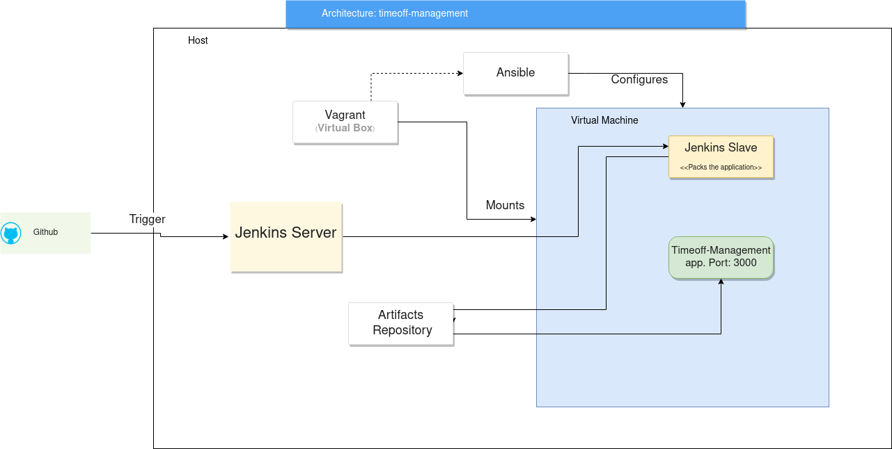

# Documentation for Technical Interview - Gorilla Logic 

## What was done? 

  - Mounted a Jenkins Server on localhost
  - Created a Continuous Integration solution using **.jenkinsfile** files
  - The following files were defined (Infrastructure-as-code): 
    - Vagrant configuration file: ```Vagrantfile```, with vagrant init
    - Ansible playbook file: ```virtualmachine.yml```
    - Both files are part of the repository. Details of implementation are in the next section

  - Repository on github, URL: https://github.com/JoelBarrantes/timeoff-management-application
  - For the artifacts, a  **Nexus** artifact repository was used.


## Details of implementation
### Model


### Jenkins

- Jenkins Server was configured using a Jenkins docker image: ```docker run --name myjenkins -p 8080:8080 -p 50000:50000 -v /var/jenkins_home jenkins```

Jenkins was configured as follows:
- I set up an environment variable in the **HOST** for storing the secret for registering agents, called **JENKINS_SECRET**.
- A jenkins slave node was added, called **Slave Node**
- A new **Folder** item was added, called **Builds**
- A **Pipeline** was added for the code build. In this pipeline, we perform the following steps:
    - The Jenkins Slave (in our case, the deployment environment), clones the repository code as the initial step. 
    - ```npm install``` is performed over the code folder. 
    - The application is packed in pushed to the artifacts repository.
    - Jenkinsfile:
```       
timestamps 
{	

    node('buildagent') {
		
        stage('Pull repository')
        {
            cleanWs()
            git credentialsId: 'SSHKey', url: 'https://github.com/JoelBarrantes/timeoff-management-application'          
        }

        
        stage('npm Publish'){

            sh 'npm install'
            sh 'npm install npm-pack-all'
            sh 'node node_modules/.bin/npm-pack-all'
            def version = sh(returnStdout: true, script:'node -p "require(\'./package.json\').version"').trim()
            echo "${version}"
            sh 'mv *.tgz drop.tgz'
            nexusArtifactUploader(
                nexusVersion: 'nexus3',
                protocol: 'http',
                nexusUrl: '10.0.2.2:8081/',
                repository: 'Artifactory',
                version: "${version}",
                credentialsId: 'nexus',
                artifacts: [
                    [artifactId: "TimeOff-Management",
                    classifier: '',
                    file: "drop.tgz",
                    type: "tgz"]
                ])
            nexusArtifactUploader(
                nexusVersion: 'nexus3',
                protocol: 'http',
                nexusUrl: '10.0.2.2:8081/',
                repository: 'Artifactory',
                credentialsId: 'nexus',
                artifacts: [
                    [artifactId: "TimeOff-Management",
                    classifier: '',
                    file: "drop.tgz",
                    type: "tgz"]
                ])
            
        
        }
                
    }
}

```
- A new folder was added called "Deployments"
- A new **Pipeline** was defined for the deployment of the application:
    - Artifact is downloaded from the repository
    - ```npm start``` is performed, and the process is dettached from the slave to allow it to keep running.
    - JenkinsFile:
```    
timestamps 
{	

    node('deployagent') {
		
		dir('package') {
            sh 'pkill node || true'
            cleanWs()
        }
        stage('Deploy'){

            httpRequest outputFile: 'drop.tgz', responseHandle: 'NONE', url: 'http://10.0.2.2:8081/repository/Artifactory/TimeOff-Management/TimeOff-Management-.tgz', wrapAsMultipart: false
            sh 'tar -xvf drop.tgz'
            dir('package') {

                sh 'JENKINS_NODE_COOKIE=dontKillMe nohup npm start &'

                    
            }
                
        }
                
    }
}
```


    
### Vagrantfile

The virtual machine is defined as follows:

 ``` 
Vagrant.configure("2") do |config|

  config.vm.box = "hashicorp/bionic64"
  config.vm.provision "ansible" do |ansible|
    config.vm.network "forwarded_port", guest: 3000, host: 3000
    ansible.playbook="virtualmachine.yml"
    ansible.extra_vars = {
      jenkins_secret: ENV['JENKINS_SECRET'],
    }

  end
end
``` 

In here, we forward the port 3000 of the virtual machine to the port 3000 of the host, to grant the host access to the application. 

As for the virtual machine configuration, it was done via Ansible


### Ansible playbook

The following ansible playbook was defined:
``` 
- hosts: all

  tasks:
    - name: add signature
      become: yes
      apt_key:
        url: "https://deb.nodesource.com/gpgkey/nodesource.gpg.key"
        state: present

    - name: add repository
      become: yes
      apt_repository:
        repo: "deb https://deb.nodesource.com/node_14.x bionic main"
        state: present
        update_cache: yes

    - name: apt install nodejs
      become: yes
      apt:
        name: nodejs
        state: present  

    - name: apt install gcc
      become: yes
      apt:
        name: gcc
        state: present

    - name: apt install g++
      become: yes
      apt:
        name: g++
        state: present  

    - name: apt install sqlite3
      become: yes
      apt:
        name: sqlite3
        state: present
    
    - name: apt install java
      become: yes
      apt:
        name: default-jre
        state: present
    
    - name: Download Agent from Jenkins Server
      get_url: 
        url: http://10.0.2.2:8080/jnlpJars/agent.jar
        dest: /tmp/agent.jar
    
    - name: Create agent directory
      ansible.builtin.file:
        path: /tmp/workspace
        state: directory

    - name: Run Slave Agent
      shell: "nohup java -jar agent.jar -jnlpUrl http://10.0.2.2:8080/computer/Slave%20Node/jenkins-agent.jnlp -secret {{ jenkins_secret }} -workDir /tmp/workspace </dev/null >/dev/null 2>&1 &"
      args: 
        chdir: /tmp/

```

In here, we configured the provisioned virtual machine, by installing necessary packages, such as nodejs and java. 

The configuration as a Jenkins Slave is also done via this configuration: 
- The agent.jar is downloaded from the Jenkins Server.
- The workspace is defined
- The agent is executed with java, unattached from the main process.
    

